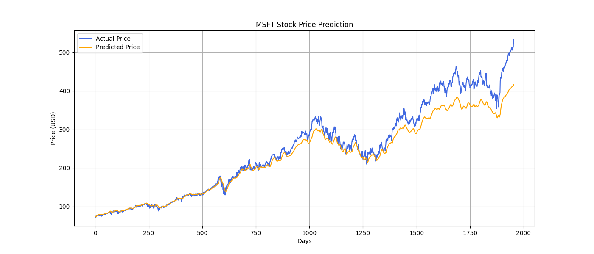

<<<<<<< HEAD
# stock-price-prediction
A Python project analyzing and forecasting Microsoft stock closing prices using time series data
=======

This project was developed as part of the Microsoft AI Innovators Summer Internship Program.
The goal is to build a deep learning model that can predict future stock prices based on historical data using PyTorch.

🎯 Project Overview

Stock price prediction is a classic time series forecasting problem. In this project, we:

- Use historical MSFT stock data from Kaggle
- Process and prepare the data using `pandas`
- Build a neural network using `PyTorch`
- Train and evaluate the model with error metrics (MAE, RMSE)
- Visualize actual vs. predicted prices

This project focuses on Apple Inc. (AAPL) stock as a case study, but the code is adaptable for any ticker.

🛠️ Technologies Used

- Python
- PyTorch
- pandas
- matplotlib
- scikit-learn

 📁 Project Structure
stock-prediction/
├── data/                  
├── notebooks/            
└── README.md  

📊 Example Result

-Mean Absolute Error (MAE): ~ 20.50

-Root Mean Squared Error (RMSE): ~31.29

>>>>>>> f7cb15c (Update README.md)
